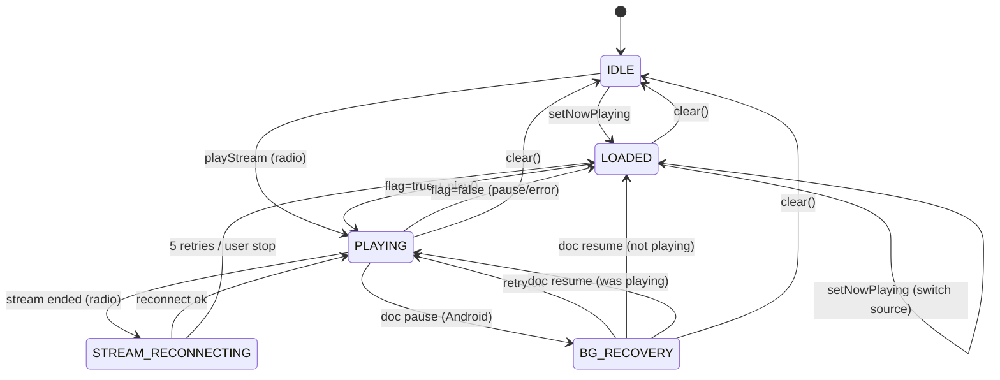

# Audio Playback Lifecycle — State Spec v1
> **Source:** `src/lib/stores/mediaEngine.svelte.ts` (673L)
> **Authority:** code — the engine is a $state object; views drive their own `<audio>` elements.
> **Initial:** `IDLE`
> **Last reconciled:** 2026-07-18

## States (5)

| # | State | Condition | Description |
|---|-------|-----------|-------------|
| 1 | `IDLE` | `item==null && source==null && isPlaying==false` | No content loaded. All per-source flags false. No transport handlers registered (or stale). |
| 2 | `LOADED` | `item!=null && source!=null && isPlaying==false` | Content ready. Handlers registered via `setPlaybackHandlers`/`setSkipHandlers`. Audio element exists but is paused/stopped. |
| 3 | `PLAYING` | `item!=null && source!=null && isPlaying==true` | Audio active. Exactly one per-source flag is true — or two for dual-deck mixing (musicA+musicB) / B-radio mix. WakeLock held (web). |
| 4 | `STREAM_RECONNECTING` | `source=='radio' && _streamShouldPlay==true && reconnect timer active` | Radio stream dropped unexpectedly. Exponential backoff reconnect in progress (1s→2s→4s→8s→16s, max 5 attempts). Transient — always resolves to PLAYING or LOADED. |
| 5 | `BG_RECOVERY` | `backgroundResumeArmed==true` (Android only) | App backgrounded on Android while audio was playing. Retry loop: 180ms initial + 250ms×3 retries, then 5s watchdog. Transient — resolves on document 'resume' or recovery. |

**Closed world:** any condition not matching the above 5 states is invalid. `item!=null` without `source!=null` is invalid. `isPlaying==true` without `item!=null` is invalid.

## Transitions (16)

| # | From | Event | Guard | To | Effects |
|---|------|-------|-------|----|---------|
| T1 | `IDLE` | `setNowPlaying(item,source)` | — | `LOADED` | item, source, currentTime=0, duration set. Handlers MUST be registered BEFORE the next play. |
| T2 | `IDLE` | `playStream(url,item)` | — | `PLAYING` | Radio only. Calls `claimAudio('radio')`, sets item/source='radio', creates `_streamAudio`, sets radioPlaying=true, `_streamShouldPlay=true`. Sets internal playback handlers to stream methods. |
| T3 | `LOADED` | view sets per-source flag=true + audio.play() succeeds | handlers registered | `PLAYING` | `isPlaying→true`. WakeLock acquired (web). MediaSession.playbackState='playing'. MediaControls.updatePlaybackState(isPlaying=true). |
| T4 | `LOADED` | `clear()` | — | `IDLE` | All flags=false, item=null, source=null, currentTime=0, duration=0, stream stopped, reconnect cancelled. WakeLock released (web). MediaSession.metadata=null. |
| T5 | `LOADED` | new source `setNowPlaying(item,source)` | — | `LOADED` | Old item/source/currentTime/duration overwritten. Old handlers become stale — new view MUST re-register before play. |
| T6 | `PLAYING` | view sets per-source flag=false (user pause / audio-focus loss / stream pause) | — | `LOADED` | `isPlaying→false`. WakeLock released (web). MediaSession.playbackState='paused'. Item/source preserved. |
| T7 | `PLAYING` | audio error event | — | `LOADED` | Per-source flag=false. `isPlaying→false`. Item/source preserved. Toast notification via `addToast()`. |
| T8 | `PLAYING` | `clear()` | — | `IDLE` | Same effects as T4. |
| T9 | `PLAYING` | radio stream 'ended' + `_streamShouldPlay==true` | source=='radio' | `STREAM_RECONNECTING` | radioPlaying=false. `reconnectStream(url,item)` called with exponential backoff (`min(1000×2^(n-1), 16000)`ms). Max 5 attempts. |
| T10 | `PLAYING` | Android `document 'pause'` | `Capacitor.platform=='android' && isPlaying && item!=null` | `BG_RECOVERY` | `backgroundResumeArmed=true`. 180ms then 250ms×3 retry loop calling `_onPlay()`. 5s watchdog interval starts. |
| T11 | `STREAM_RECONNECTING` | reconnect succeeds (`playStream` re-invoked) | `_streamShouldPlay==true` | `PLAYING` | New `_streamAudio` created, radioPlaying=true. Timer cleared. |
| T12 | `STREAM_RECONNECTING` | 5 reconnect attempts exhausted | — | `LOADED` | Timer cleared. Item/source='radio' preserved. isPlaying=false. |
| T13 | `STREAM_RECONNECTING` | user `pauseStream()` sets `_streamShouldPlay=false` | — | `LOADED` | Reconnect cancelled. Stream audio stopped. radioPlaying=false. |
| T14 | `BG_RECOVERY` | retry succeeds (`audio.play()` plays) | — | `PLAYING` | `bgResumeArmed=false`. Timers cleared. Watchdog stopped. |
| T15 | `BG_RECOVERY` | `document 'resume'` fires | — | `LOADED` or `PLAYING` | `clearBackgroundResume()`: armed=false, all timers+watchdog cleared. `_onPlay()` called if arming state had item≠null and !isPlaying. |
| T16 | `BG_RECOVERY` | `clear()` | — | `IDLE` | `clearBackgroundResume()` + same effects as T4. |

## Invariants & forbidden transitions

- `IDLE → PLAYING` is forbidden except via `playStream` (radio shortcut — T2). All other sources MUST go through `LOADED` and register handlers first.
- `PLAYING → PLAYING` is forbidden (no self-transition). Source switches go PLAYING → LOADED → PLAYING.
- `LOADED` MUST have handlers registered before `PLAY` (T3). Violation = dev-mode console warning, audio may not respond to MiniPlayer/MediaSession.
- Dual music decks (`musicPlayingA` + `musicPlayingB`) may both be true simultaneously — `claimAudio` skips sibling decks.
- Deck B may mix with podcast/radio (`musicPlayingB` + `podcastPlaying`/`radioPlaying`) — `claimAudio` skips those.
- All other flag combinations are exclusive: at most one of {podcastPlaying, radioPlaying, mixerPlaying} may be true.
- `STREAM_RECONNECTING` only valid when `source=='radio'`.
- `BG_RECOVERY` only valid on Android (`Capacitor.platform=='android'`). On web it is unreachable.
- `clear()` is always valid from any state (universal reset).
- `setNowPlaying` from any state overwrites item/source/currentTime/duration — no guard or precondition.

---

## Diagram (for humans; LLMs may skip)

