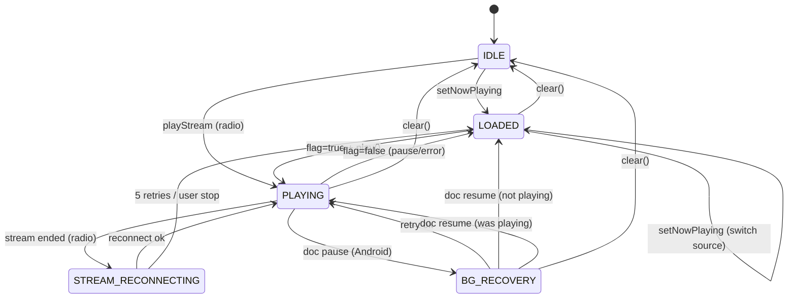

# Audio Playback Lifecycle — State Spec v1
> **Source:** `src/lib/stores/mediaEngine.svelte.ts` (832L)
> **Authority:** code — the engine is a $state object; views drive their own `<audio>` elements.
> **Initial:** `IDLE`
> **Last reconciled:** 2026-10-06

## States (5)

| # | State | Condition | Description |
|---|-------|-----------|-------------|
| 1 | `IDLE` | `item==null && source==null && isPlaying==false` | No content loaded. All per-source flags false. No transport handlers registered (or stale). |
| 2 | `LOADED` | `item!=null && source!=null && isPlaying==false` | Content ready. Handlers registered via `setPlaybackHandlers`/`setSkipHandlers`. Audio element exists but is paused/stopped. |
| 3 | `PLAYING` | `item!=null && source!=null && isPlaying==true` | Audio active. One per-source flag is true, or two when Deck B mixes: musicA+musicB, or musicB + any one of podcast/radio/youtube/mixer. WakeLock held (web). |
| 4 | `STREAM_RECONNECTING` | `source=='radio' && _streamShouldPlay==true && reconnect timer active` | Radio stream dropped unexpectedly. Exponential backoff reconnect in progress (1s→2s→4s→8s→16s, max 5 attempts). Transient — always resolves to PLAYING or LOADED. |
| 5 | `BG_RECOVERY` | `backgroundResumeArmed==true` (Android only) | App backgrounded on Android while the user wanted playback. Armed from the `document` 'pause' event on `item!=null && (isPlaying \|\| userWantsPlayback)` — see `_userWantsPlayback`. Retry loop: 180ms initial + 250ms×3 retries, then 5s watchdog. Disarmed only by an explicit user pause or `clear()`. Transient — resolves on document 'resume' or recovery. |

**Closed world:** any condition not matching the above 5 states is invalid. `item!=null` without `source!=null` is invalid. `isPlaying==true` without `item!=null` is invalid.

## Transitions (16)

| # | From | Event | Guard | To | Effects |
|---|------|-------|-------|----|---------|
| T1 | `IDLE` | `setNowPlaying(item,source)` | — | `LOADED` | item, source, currentTime=0, duration set. Handlers MUST be registered BEFORE the next play. |
| T2 | `IDLE` | `playStream(url,item)` | — | `PLAYING` | Radio only. Calls `claimAudio('radio')`, sets item/source='radio', creates `_streamAudio`, sets radioPlaying=true, `_streamShouldPlay=true`. Sets internal playback handlers to stream methods. |
| T3 | `LOADED` | view sets per-source flag=true + audio.play() succeeds | handlers registered | `PLAYING` | `isPlaying→true`. WakeLock acquired (web). MediaSession.playbackState='playing'. MediaControls.updatePlaybackState(isPlaying=true). |
| T4 | `LOADED` | `clear()` | — | `IDLE` | All flags=false, item=null, source=null, currentTime=0, duration=0, per-deck state (deckAItem/deckBItem/deckACurrentTime/deckBCurrentTime/deckADuration/deckBDuration) reset to null/0, stream stopped, reconnect cancelled. WakeLock released (web). MediaSession.metadata=null. |
| T5 | `LOADED` | new source `setNowPlaying(item,source)` | — | `LOADED` | Old item/source/currentTime/duration overwritten. Old handlers become stale — new view MUST re-register before play. |
| T6 | `PLAYING` | view sets per-source flag=false (user pause / audio-focus loss / stream pause) | — | `LOADED` | `isPlaying→false`. WakeLock released (web). MediaSession.playbackState='paused'. Item/source preserved. |
| T7 | `PLAYING` | audio error event | — | `LOADED` | Per-source flag=false. `isPlaying→false`. Item/source preserved. Toast notification via `addToast()`. |
| T8 | `PLAYING` | `clear()` | — | `IDLE` | Same effects as T4 (including per-deck state reset). |
| T9 | `PLAYING` | radio stream 'ended' + `_streamShouldPlay==true` | source=='radio' | `STREAM_RECONNECTING` | radioPlaying=false. `reconnectStream(url,item)` called with exponential backoff (`min(1000×2^(n-1), 16000)`ms). Max 5 attempts. |
| T10 | `PLAYING` | Android `document 'pause'` | `Capacitor.platform=='android' && item!=null && (isPlaying \|\| userWantsPlayback)` | `BG_RECOVERY` | `backgroundResumeArmed=true`. 180ms then 250ms×3 retry loop calling `_onPlay()`. 5s watchdog interval starts. Every retry bails out (and disarms) when `userWantsPlayback==false` — a deliberate pause is never undone. |
| T11 | `STREAM_RECONNECTING` | reconnect succeeds (`playStream` re-invoked) | `_streamShouldPlay==true` | `PLAYING` | New `_streamAudio` created, radioPlaying=true. Timer cleared. |
| T12 | `STREAM_RECONNECTING` | 5 reconnect attempts exhausted | — | `LOADED` | Timer cleared. Item/source='radio' preserved. isPlaying=false. |
| T13 | `STREAM_RECONNECTING` | user `pauseStream()` sets `_streamShouldPlay=false` | — | `LOADED` | Reconnect cancelled. Stream audio stopped. radioPlaying=false. |
| T14 | `BG_RECOVERY` | retry succeeds (`audio.play()` plays) | — | `PLAYING` | `bgResumeArmed=false`. Timers cleared. Watchdog stopped. |
| T15 | `BG_RECOVERY` | `document 'resume'` fires | — | `LOADED` or `PLAYING` | `clearBackgroundResume()`: armed=false, all timers+watchdog cleared. `_onPlay()` called if arming state had item≠null and !isPlaying. |
| T16 | `BG_RECOVERY` | `clear()` | — | `IDLE` | `clearBackgroundResume()` + same effects as T4. |

## Invariants & forbidden transitions

- `IDLE → PLAYING` is forbidden except via `playStream` (radio shortcut — T2). All other sources MUST go through `LOADED` and register handlers first.
- `PLAYING → PLAYING` is forbidden (no self-transition). Source switches go PLAYING → LOADED → PLAYING.
- `LOADED` MUST have handlers registered before `PLAY` (T3). Violation = dev-mode console warning, audio may not respond to MiniPlayer/MediaSession.
- Both music decks (`musicPlayingA` + `musicPlayingB`) may be true simultaneously.
- Deck B is the mixing deck: `musicPlayingB` may be true together with any one other source (`musicPlayingA`, `podcastPlaying`, `radioPlaying`, `youtubePlaying`, `mixerPlaying`). `claimAudio` neither stops another source for a `musicB` claim nor stops `musicB` for any other claim.
- Every other combination among {musicA, podcast, radio, youtube, mixer} stays exclusive.
- The MiniPlayer and the transport follow `mediaEngine.displayedSource`: the visible view's own source while it plays, otherwise a non-deck source that owns the primary state and is playing (YouTube/podcast/radio), otherwise the first other playing source, otherwise the view's own source (paused). Each source re-claims `setPlaybackHandlers`/`setSkipHandlers` when `displayedSource` points at it, and `mediaEngine.pause()`/`resume()` prefer the registered handler over the engine-owned radio stream. So the shown title and the play/pause button always describe the same source, even when Deck B keeps playing underneath an idle view.
- Per-source flags that follow the view-owned `<audio>` pattern: music, podcast, **youtube**. Only radio is engine-owned (`_streamAudio`, hence `STREAM_RECONNECTING`).
- `STREAM_RECONNECTING` only valid when `source=='radio'`.
- `BG_RECOVERY` only valid on Android (`Capacitor.platform=='android'`). On web it is unreachable.
- **Intent, not state:** the lock/screen-off transition delivers both the WebView's element pause and the `document` 'pause' event, and the element pause can land first. Arming on `isPlaying` alone therefore saw "not playing", disarmed the recovery, and playback stayed dead — locking the phone from the foreground stopped audio for good while backgrounding first (`onPause` fires a full activity animation before the WebView is hidden) kept playing. `userWantsPlayback` is latched when any source plays and cleared only by `markUserPaused()`: in-app pause buttons (`pausePlayback`), `mediaEngine.pause()`, `pauseStream()`, `clear()`, the lock-screen/notification 'pause' action, and the sleep timer (which reaches the same `_onPause` handlers).
- Known hole: `item==null` still disarms the recovery, so a deck playing while `item` is unset (deck B with the music tab unfocused) has no background recovery.
- `clear()` is always valid from any state (universal reset). Also resets per-deck state (deckAItem/deckBItem → null, per-deck time/duration → 0).
- `setNowPlaying` from any state overwrites item/source/currentTime/duration — no guard or precondition.

---

## Diagram (for humans; LLMs may skip)

```mermaid
stateDiagram-v2
    [*] --> IDLE

    IDLE --> LOADED: setNowPlaying
    IDLE --> PLAYING: playStream (radio)

    LOADED --> PLAYING: flag=true + play()
    LOADED --> IDLE: clear()
    LOADED --> LOADED: setNowPlaying (switch source)

    PLAYING --> LOADED: flag=false (pause/error)
    PLAYING --> IDLE: clear()
    PLAYING --> STREAM_RECONNECTING: stream ended (radio)
    PLAYING --> BG_RECOVERY: doc pause (Android)

    STREAM_RECONNECTING --> PLAYING: reconnect ok
    STREAM_RECONNECTING --> LOADED: 5 retries / user stop

    BG_RECOVERY --> PLAYING: retry ok
    BG_RECOVERY --> LOADED: doc resume (not playing)
    BG_RECOVERY --> PLAYING: doc resume (was playing)
    BG_RECOVERY --> IDLE: clear()
```
