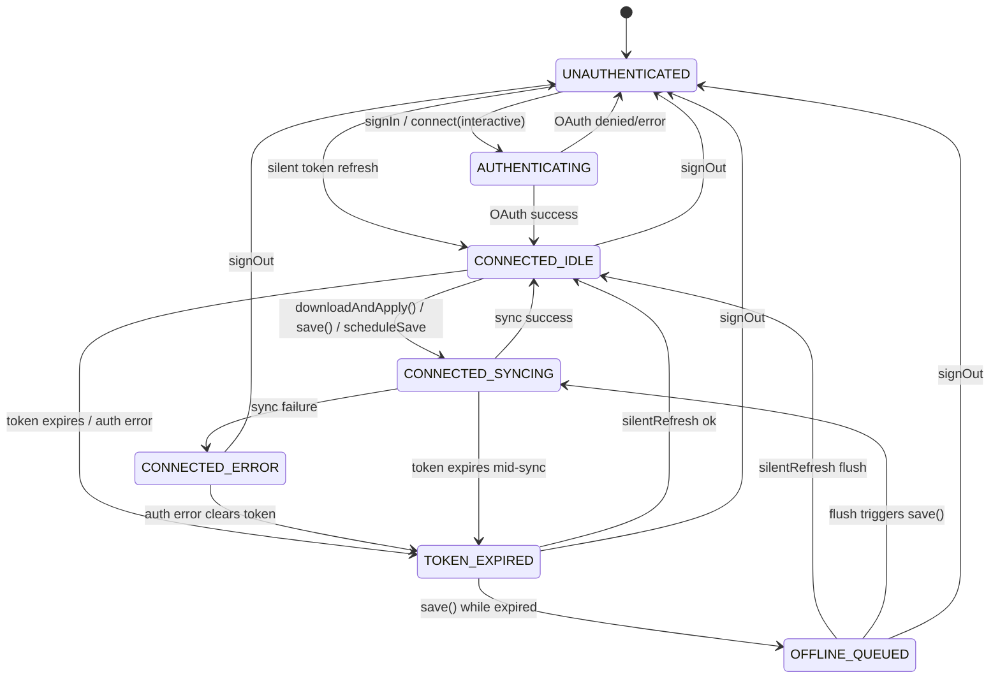

# Google Drive Auth + Config Sync — State Spec v1
> **Sources:** `src/lib/stores/googleDriveSession.svelte.ts` (183L), `src/lib/stores/driveConfigSync.svelte.ts` (370L)
> **Authority:** code — two cooperating stores with independent token lifecycles; `driveConfigSync` reuses `googleDriveSession` token when possible.
> **Initial:** `UNAUTHENTICATED`
> **Last reconciled:** 2026-07-18

## States (7)

| # | State | Condition | Description |
|---|-------|-----------|-------------|
| 1 | `UNAUTHENTICATED` | `googleDriveSession.user==null && driveConfigSync.accessToken==''` | No stored session. User has never signed in, or previous token was revoked/expired and cleared. |
| 2 | `AUTHENTICATING` | `googleDriveSession.isAuthenticating==true` or `driveConfigSync.connect(interactive=true)` in-flight | OAuth consent flow active. Browser may show Google sign-in popup (web) or native Play Services dialog (Android). |
| 3 | `CONNECTED_IDLE` | `driveConfigSync.isConnected==true && driveConfigSync.status∈{idle, saved}` | Token valid (>60s remaining). No sync in progress. Settings can be read/written. |
| 4 | `CONNECTED_SYNCING` | `driveConfigSync.isConnected==true && driveConfigSync.status=='syncing'` | `downloadAndApply()` or `save()` in progress — HTTP call to Drive appdata endpoint. |
| 5 | `CONNECTED_ERROR` | `driveConfigSync.isConnected==true && driveConfigSync.status=='error'` | Last sync operation failed. `errorMessage` set. Differentiated: auth error, rate-limit (10s retry), 404, generic. Token may still be valid for future attempts. |
| 6 | `TOKEN_EXPIRED` | `driveConfigSync.isConnected==false && driveConfigSync.hasSession==true` | Token expired naturally or was invalidated by an auth error. `silentRefresh()` may recover. `googleDriveSession` may still have a valid main-session token. |
| 7 | `OFFLINE_QUEUED` | `driveConfigSync.pendingSave==true && driveConfigSync.isConnected==false` | A `save()` call failed because the token was invalid and `silentRefresh()` also failed. The write is queued. Will auto-flush on the next successful `silentRefresh()` (scheduled at 80% token lifetime) or on explicit `connect()`. |

**Closed world:** `pendingSave==true` while `isConnected==true` is invalid (queue only set when disconnected). `status=='syncing'` while `!isConnected` is invalid.

## Transitions (14)

### Auth flow

| # | From | Event | Guard | To | Effects |
|---|------|-------|-------|----|---------|
| T1 | `UNAUTHENTICATED` | user taps "Sign In" | `googleDriveSession.configured==true` | `AUTHENTICATING` | `googleDriveSession.isAuthenticating=true`. OAuth flow starts — WebView `requestGoogleDriveAccessToken({prompt:''})` or native Play Services. |
| T2 | `AUTHENTICATING` | OAuth success | — | `CONNECTED_IDLE` | `googleDriveSession`: accessToken, expiresAt, user stored; persisted to localStorage. `isAuthenticating=false`. `driveConfigSync.connect(interactive=false)` reuses main-session token if available, else requests its own appdata-scoped token. |
| T3 | `AUTHENTICATING` | OAuth denied / network error | — | `UNAUTHENTICATED` | `googleDriveSession.error` set. `isAuthenticating=false`. |
| T4 | `UNAUTHENTICATED` | `googleDriveSession.ensureAccessToken(interactive=false)` succeeds | stored refresh token valid | `CONNECTED_IDLE` | Silent token refresh from stored credentials. No user prompt. |

### Sync operations (within CONNECTED states)

| # | From | Event | Guard | To | Effects |
|---|------|-------|-------|----|---------|
| T5 | `CONNECTED_IDLE` | `downloadAndApply()` | — | `CONNECTED_SYNCING` | `status='syncing'`. Fetches Drive appdata config file. Enters conflict check. |
| T6 | `CONNECTED_SYNCING` | download succeeds, `driveSavedAt > localSavedAt` | downloaded config exists | `CONNECTED_IDLE` (status→saved) | All 5 setting stores updated field-by-field. `localSavedAt` set to `config.savedAt`. `lastSyncedAt` set to now. `status='saved'`. |
| T7 | `CONNECTED_SYNCING` | download succeeds, `localSavedAt > driveSavedAt` | local is newer | `CONNECTED_SYNCING` (self-loop: calls `save()`) | Drive config discarded. `save()` called to push local state to Drive. Transitions to T8 on upload success or T9 on failure. |
| T8 | `CONNECTED_SYNCING` | `save()` / upload succeeds | — | `CONNECTED_IDLE` (status→saved) | `uploadDriveConfig()` returns 200. `localSavedAt = now`. `pendingSave=false`. `lastSyncedAt=now`. `status='saved'`. |
| T9 | `CONNECTED_SYNCING` | `downloadAndApply()` or `save()` fails with error | — | `CONNECTED_ERROR` | `status='error'`. `_handleError()` classifies: auth→clear token, rate-limit→10s retry, 404→"not found", generic→errorMessage. |

### Authed settings mutations

| # | From | Event | Guard | To | Effects |
|---|------|-------|-------|----|---------|
| T10 | `CONNECTED_IDLE` | `scheduleSave()` called | any settings store mutated, 3s debounce | `CONNECTED_SYNCING` | After 3s debounce: `save()` executes. Same path as T8/T9. |

### Token lifecycle

| # | From | Event | Guard | To | Effects |
|---|------|-------|-------|----|---------|
| T11 | `CONNECTED_IDLE` or `CONNECTED_ERROR` or `CONNECTED_SYNCING` | token expires or auth error clears token | — | `TOKEN_EXPIRED` | `isConnected→false`. `expiresAt` may be stale. Token refresh timer (80% lifetime) already fired; if silent refresh failed, no retry until user action. |
| T12 | `TOKEN_EXPIRED` | `silentRefresh()` succeeds | scheduled timer or `save()` trigger | `CONNECTED_IDLE` | New token stored via `_storeToken()`. If `pendingSave==true`: auto-flushes by calling `save()` → enters `CONNECTED_SYNCING`. |
| T13 | `TOKEN_EXPIRED` | `save()` called | `hasSession==true` | `OFFLINE_QUEUED` | `silentRefresh()` attempted but failed (offline / revoked). `pendingSave=true`. |

### Disconnect

| # | From | Event | Guard | To | Effects |
|---|------|-------|-------|----|---------|
| T14 | any state | `disconnect()` / `signOut()` | — | `UNAUTHENTICATED` | All tokens cleared (`accessToken=''`, `expiresAt=0`). `pendingSave=false`. Timers cleared. `status='idle'`. `googleDriveSession` signOut revokes token, clears user. localStorage cleared. |

## Invariants & forbidden transitions

- `CONNECTED_SYNCING` MUST NOT enqueue a second concurrent sync. The `status='syncing'` guard prevents overlapping `downloadAndApply()` or `save()` calls.
- `scheduleSave()` debounces to 3s — rapid settings changes do not cause rapid uploads. Only the last value within the window is saved.
- Conflict resolution is last-write-wins by ISO timestamp. **No clock sync assumed** — conflict is relative (local-vs-drive), not absolute. If both sides have the same `savedAt`, Drive wins.
- Token refresh is scheduled at `80% of expires_in - 60s` — fires before the 60s `isConnected` guard trips.
- `driveConfigSync` token is **separate** from `googleDriveSession` token, but `connect()` and `silentRefresh()` prefer reusing the main session token as an optimization. If the main token has a different scope, a separate appdata token is requested.
- `_handleError()` for auth errors clears the token (`accessToken=''`) but does NOT clear `pendingSave` — the write is queued for post-reconnect flush.
- Rate-limit errors schedule a 10s retry via `setTimeout(() => save(), 10000)` — not a state transition, more of a self-healing effect.
- `disconnect()` and `signOut()` are valid from any state and always result in `UNAUTHENTICATED`.

---

## Diagram (for humans; LLMs may skip)

