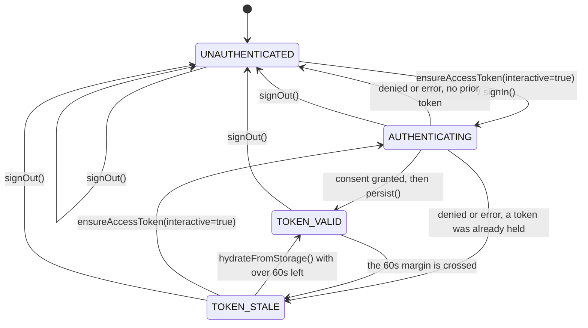
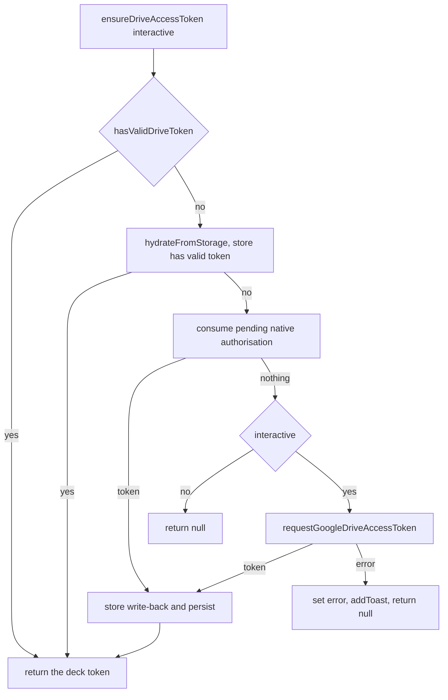

# Google Drive Auth – State Spec v1
> **Sources:** `src/lib/stores/googleDriveSession.svelte.ts` (183L), `src/lib/drive/driveSession.svelte.ts` (134L)
> **Authority:** code – one store owns persistence, one factory owns a token per deck; a deck's own token shadows the store while it is valid.
> **Initial:** `UNAUTHENTICATED`
> **Last reconciled:** 2026-10-05

> **Scope:** this spec covers the OAuth access-token lifecycle only. The appdata
> config sync described by the previous revision (`driveConfigSync.svelte.ts`,
> the `CONNECTED_*` states, conflict resolution, the offline save queue) was
> deleted in `cb2b5ae` ("feat: remove the Google Drive settings/podcast sync").
> Nothing in `src/` implements it and nothing replaced it: settings and podcasts
> now persist on-device only (see `docs/adr/0002-file-move-copy-delete.md`).
> The file name is unchanged because `src/lib/stores/googleDriveSession.svelte.ts:1`
> and `docs/state/_index.md` link to it.

Two layers cooperate, and only one of them persists:

- `googleDriveSession` (`src/lib/stores/googleDriveSession.svelte.ts`) is the single
  shared store and the persistence owner (`localStorage` key `google-drive-session`).
  It also holds `user`, `error`, `isAuthenticating`, `configured` and `clientId`.
- `driveSession` (`src/lib/drive/driveSession.svelte.ts`) is one instance per deck,
  built by `createDriveSession({ addToast, clientId })`. It holds its own
  `accessToken`, `expiresAt`, `user` and `error`, never touches `localStorage`
  itself, and writes back through `googleDriveSession` plus
  `googleDriveSession.persist()`.

The states below are conditions on `googleDriveSession`. A deck instance mirrors
them and can lag the store.

## States (4)

| # | State | Condition | Description |
|---|-------|-----------|-------------|
| 1 | `UNAUTHENTICATED` | `googleDriveSession.accessToken==''` | No token in memory and none stored. Nothing was ever stored, or `persist()` dropped an empty/expired entry, or `signOut()` cleared it. |
| 2 | `AUTHENTICATING` | `googleDriveSession.isAuthenticating==true` | `ensureAccessToken(interactive=true)` passed its `configured` guard and is awaiting the GIS popup (web) or the Play Services dialog (Android). Only that call sets the flag. |
| 3 | `TOKEN_VALID` | `hasValidToken()==true`, i.e. `accessToken!='' && Date.now() < expiresAt-60000` | Usable token with more than the 60s safety margin left. Every request path skips network work while this holds. |
| 4 | `TOKEN_STALE` | `accessToken!='' && hasValidToken()==false` | Token present but inside the 60s margin or already past `expiresAt`. No refresh token and no timer exist, so recovery needs a stored session, the pending native authorisation, or a fresh interactive request. |

**Closed world:** `accessToken=='' && hasValidToken()==true` is invalid.
`isAuthenticating==true` with an empty `accessToken` is the normal first sign-in,
not a contradiction. The machine has no timer-driven state: neither module
schedules work.

## Transitions (11)

### Session store

| # | From | Event | Guard | To | Effects |
|---|------|-------|-------|----|---------|
| T1 | `UNAUTHENTICATED`, `TOKEN_STALE` | `ensureAccessToken(interactive=true)`, also reached through `signIn()` | `configured==true` | `AUTHENTICATING` | `refreshConfiguration()` and `hydrateFromStorage()` run first. `isAuthenticating=true`, then `requestGoogleDriveAccessToken({clientId, prompt:''})`. |
| T2 | `AUTHENTICATING` | consent granted | — | `TOKEN_VALID` | `accessToken` and `expiresAt = Date.now()+Number(expires_in ?? 3600)*1000` stored, `error=''`, `persist()` writes `localStorage`. `isAuthenticating=false` in the `finally`. |
| T3 | `AUTHENTICATING` | denied or network error | — | `TOKEN_STALE`, or `UNAUTHENTICATED` when no token was held | `error=formatGoogleDriveAuthError(error)`, returns `null`, `isAuthenticating=false`. A previously held `accessToken` is not cleared. |
| T4 | `TOKEN_VALID` | `ensureAccessToken(any)` | `hasValidToken()==true` after `hydrateFromStorage()` | `TOKEN_VALID` (self-loop) | `refreshConfiguration()`, `hydrateFromStorage()`, `persist()`, returns the token. No network and no user prompt. |
| T5 | `UNAUTHENTICATED`, `TOKEN_STALE` | `hydrateFromStorage()` finds a stored session | stored `expiresAt > Date.now()` | `TOKEN_VALID`, or `TOKEN_STALE` when under 60s remains | `accessToken`, `expiresAt` and `user` copied from `localStorage`. Pure read. |
| T6 | `UNAUTHENTICATED`, `TOKEN_STALE` | `ensureAccessToken(interactive=false)` | no usable stored session | unchanged | Returns `null` without setting `error`. Callers read `null` as "no token available". |
| T7 | `TOKEN_VALID` | `ensureUser(force=true)` succeeds | `hasValidToken()==true` | `TOKEN_VALID` (self-loop) | `fetchGoogleDriveUser(accessToken)`, `user` set, `error=''`, `persist()`. Without `force` an existing `user` short-circuits the fetch. |
| T8 | `TOKEN_VALID` | `ensureUser()` request fails | — | `TOKEN_VALID` | `error=formatGoogleDriveAuthError(error)`, returns `null`. `user` and the token are untouched. |
| T9 | `TOKEN_VALID` | the 60s margin is crossed | — | `TOKEN_STALE` | `hasValidToken()` flips to false as the clock passes `expiresAt-60000`. Nothing runs: no timer, no retry, no request. |
| T10 | any | `signOut()` | — | `UNAUTHENTICATED` | `revokeGoogleDriveAccess(accessToken)` with failures swallowed, then `accessToken=''`, `expiresAt=0`, `user=null`, `error=''`, `persist()`. The zero expiry makes `persist()` remove the `localStorage` entry. |
| T11 | any | `setError(message)` | — | unchanged | `error=message`. Token, expiry and user are untouched. |

### Deck session (`driveSession.ensureDriveAccessToken`)

The order below is behaviour, not style: it is the order the view used before the
extraction, and each step only runs when the one before it did not answer.

| # | Step | Guard | Effects |
|---|------|-------|---------|
| D1 | deck token shortcut | `hasValidDriveToken()==true`, checked before any hydration | Returns the deck's own token. No store read, no network. |
| D2 | hydrate | `googleDriveSession.hydrateFromStorage()` then `googleDriveSession.hasValidToken()` | `accessToken`, `expiresAt` and `user` copied into the deck, token returned. The store is not written to. |
| D3 | one-shot pending native authorisation | `consumePendingGoogleDriveAccessToken()` returns an `access_token` | Deck gets the token, `expiresAt = Date.now()+Number(expires_in ?? 3600)*1000`, `user` taken from the store, `error=''`. The store is written and `persist()`ed. |
| D4 | non-interactive stop | `interactive==false` | Returns `null`. `error` is left as it was. |
| D5 | interactive request | `requestGoogleDriveAccessToken({clientId, prompt: state.accessToken ? '' : 'consent'})` | Success: deck state set, store written, `persist()`ed, token returned. Failure: `error=formatGoogleDriveAuthError(error)`, `addToast({message, type:'error'})`, returns `null`. |

Notes on D3 and D5:

- D3 is Android-only. `consumePendingGoogleDriveAccessToken()` returns `null` off
  Android, and `consumePendingNativeGoogleDriveAccessToken` delegates to the
  plugin's `consumePendingAuthorizationResult`, which clears the stored result
  after reading it (`android/.../GoogleDriveNativePlugin.java:82`). A pending
  authorisation is therefore picked up once. A throw in this step is swallowed
  and the flow continues at D4.
- D5 uses `prompt:'consent'` only when the deck holds no token at all; otherwise
  it passes `''`, the same default the store uses, which per the comment in
  `googleDriveSession.svelte.ts` shows sign-in UI only when it is needed rather
  than on every request.
- `driveSession` never reads `configured` and never sets `isAuthenticating`. The
  view guards on `googleDriveConfigured` and writes `driveSession.error` itself
  (`src/lib/components/views/Mp3PlayerView.svelte:247`, `:1276`). A successful
  D3 or D5 clears `error`; D2 leaves it as it was.

## Invariants & forbidden transitions

- No silent refresh exists. Neither module stores a refresh token, schedules a
  timer or retries. A stale token is recovered only by `hydrateFromStorage()` on
  an unexpired entry, by the one-shot native consume, or by an interactive request.
- `persist()` never stores an unusable session. `writeStoredSession()` removes the
  `google-drive-session` key when `accessToken` is empty, when `expiresAt` is 0,
  or when `expiresAt <= Date.now()`.
- The two validity checks disagree on purpose. `hydrateFromStorage()` accepts a
  stored session while `expiresAt > Date.now()`, but `hasValidToken()` and
  `hasValidDriveToken()` both require the 60s margin. A stored token with less
  than a minute left hydrates and is still not valid.
- `hydrateFromStorage()` keeps the in-memory `user` when the stored entry has
  none (`stored.user ?? this.user`). The two token paths write
  `accessToken`/`expiresAt` back to the store but never `user`: the store's `user`
  is set by `hydrateFromStorage()`, `ensureUser()` or `signOut()` only, and a view
  sets the deck's copy after its own `fetchGoogleDriveUser()` call.
- Two decks must be able to hold different tokens. `createDriveSession` is a
  factory rather than a singleton for that reason; a shared instance would let
  deck A's token answer for deck B and is forbidden.
- A deck's copy is authoritative for that deck while it is valid (D1). Signing in
  or out through `googleDriveSession` does not clear a deck's already-valid token.
  A caller that needs a fresh identity must recreate the deck session.
- `driveSession` and the modules it stands for must not import from
  `src/lib/components/`, and hold no UI state: an interactive failure reaches the
  user only through the injected `addToast`.
- `error` is per layer. `googleDriveSession.error` (shown by `LoginView`) and
  `driveSession.error` (shown per deck) are separate fields and are not synced.

---

## Diagram (for humans; LLMs may skip)

```mermaid
stateDiagram-v2
    [*] --> UNAUTHENTICATED

    UNAUTHENTICATED --> AUTHENTICATING: ensureAccessToken(interactive=true) / signIn()
    AUTHENTICATING --> TOKEN_VALID: consent granted, then persist()
    AUTHENTICATING --> UNAUTHENTICATED: denied or error, no prior token
    AUTHENTICATING --> TOKEN_STALE: denied or error, a token was already held

    TOKEN_STALE --> TOKEN_VALID: hydrateFromStorage() with over 60s left
    TOKEN_STALE --> AUTHENTICATING: ensureAccessToken(interactive=true)
    TOKEN_VALID --> TOKEN_STALE: the 60s margin is crossed

    UNAUTHENTICATED --> UNAUTHENTICATED: signOut()
    TOKEN_VALID --> UNAUTHENTICATED: signOut()
    TOKEN_STALE --> UNAUTHENTICATED: signOut()
    AUTHENTICATING --> UNAUTHENTICATED: signOut()
```

```mermaid
flowchart TD
    A[ensureDriveAccessToken interactive] --> B{hasValidDriveToken}
    B -- yes --> Z[return the deck token]
    B -- no --> C[hydrateFromStorage, store has valid token]
    C -- yes --> Z
    C -- no --> D[consume pending native authorisation]
    D -- token --> E[store write-back and persist] --> Z
    D -- nothing --> F{interactive}
    F -- no --> G[return null]
    F -- yes --> H[requestGoogleDriveAccessToken]
    H -- token --> E
    H -- error --> I[set error, addToast, return null]
```
