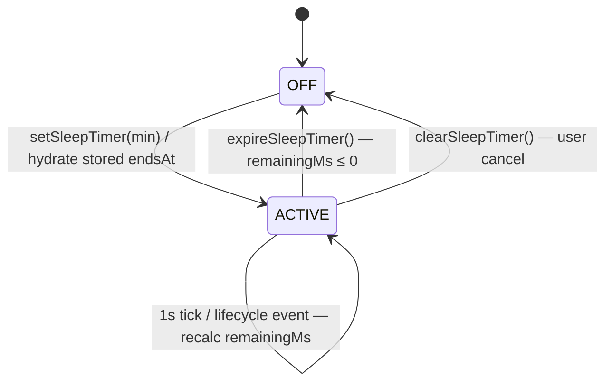

# Sleep Timer — State Spec v1
> **Source:** `src/lib/stores/sleepTimer.svelte.ts` (123L)
> **Authority:** code — flat $state object with 1s polling interval.
> **Initial:** `OFF`
> **Last reconciled:** 2026-07-18

## States (3)

| # | State | Condition | Description |
|---|-------|-----------|-------------|
| 1 | `OFF` | `isActive==false && endsAt==0 && remainingMs==0` | Timer not running. No syncInterval. Default state on app start. |
| 2 | `ACTIVE` | `isActive==true && endsAt > Date.now() && remainingMs > 0` | Timer counting down. `window.setInterval(syncSleepTimer, 1000)` running. `remainingMs` recalculated each tick. |
| 3 | `EXPIRED` | transient — `remainingMs ≤ 0` detected inside `syncSleepTimer()` | Timer just expired this tick. `expireSleepTimer()` runs synchronously: stops playback, shows toast, sets `endsAt=0`, stops interval → enters `OFF`. Never externally observable as a stable state. |

**Closed world:** `isActive==true` while `endsAt==0` or `remainingMs==0` is invalid. `remainingMs > 0` while `isActive==false` is invalid.

## Transitions (5)

| # | From | Event | Guard | To | Effects |
|---|------|-------|-------|----|---------|
| T1 | `OFF` | `setSleepTimer(minutes)` | `minutes ≥ 1` | `ACTIVE` | `lastDurationMin` saved to both `sleepTimer` and `sleepTimerSettings`. `endsAt = Date.now() + minutes×60000`. Calls `syncSleepTimer()` which starts the 1s interval. |
| T2 | `OFF` | `syncSleepTimer()` finds stored `endsAt > Date.now()` | app startup, `endsAt` persisted from prior session | `ACTIVE` | Hydrates from `sleepTimerSettings.endsAt`. Same as T1 without saving `lastDurationMin`. |
| T3 | `ACTIVE` | `syncSleepTimer()` tick: `remainingMs ≤ 0` | — | `OFF` (via EXPIRED) | `expireSleepTimer()` runs: saves `hadActiveTimer==true`. If `mediaEngine.isPlaying`: calls `_onPause() ?? mediaEngine.pause()`. Shows toast ("Sleep timer stopped playback." / "Sleep timer finished."). Sets `endsAt=0`, `remainingMs=0`, `isActive=false`. Stops syncInterval. |
| T4 | `ACTIVE` | `clearSleepTimer({silent:false})` | — | `OFF` | Sets `endsAt=0`, `remainingMs=0`, `isActive=false`. Stops syncInterval. Shows toast "Sleep timer cleared." |
| T5 | `ACTIVE` | `syncSleepTimer()` tick from lifecycle event (focus/pageshow/visibilitychange) | `Date.now() < endsAt` | `ACTIVE` | `remainingMs` recalculated from `endsAt - Date.now()`. `ensureTicking()` re-checks interval. No state change — pure refresh. |

## Invariants & forbidden transitions

- `setSleepTimer(minutes)` clamps to `≥ 1` (line: `Math.max(1, Math.round(minutes))`). Negative/zero values become 1 minute.
- `expireSleepTimer()` is ONLY called inside `syncSleepTimer()` when `remainingMs ≤ 0`. Never called directly.
- `syncSleepTimer()` is the sole entry point for expiry — the 1s interval, lifecycle listeners (focus/pageshow/visibilitychange), and `setSleepTimer` all route through it.
- `EXPIRED` is not reachable from outside — it is an internal transient within `syncSleepTimer()`.
- Lifecycle listeners (`window focus`, `pageshow`, `document visibilitychange`) only call `syncSleepTimer()` — they do not mutate state directly.
- `initSleepTimer()` is idempotent (guarded by `initialized` flag) and called once from `+page.svelte` `onMount`.
- **No fade-out.** The timer stops playback abruptly via `mediaEngine._onPause?.() ?? mediaEngine.pause()`. There is no volume ramp.
- On `beforeunload`, the interval is stopped (`stopTicking()`) but timer state is NOT cleared — `sleepTimerSettings.endsAt` persists in localStorage for next-session hydration.

---

## Diagram (for humans; LLMs may skip)

