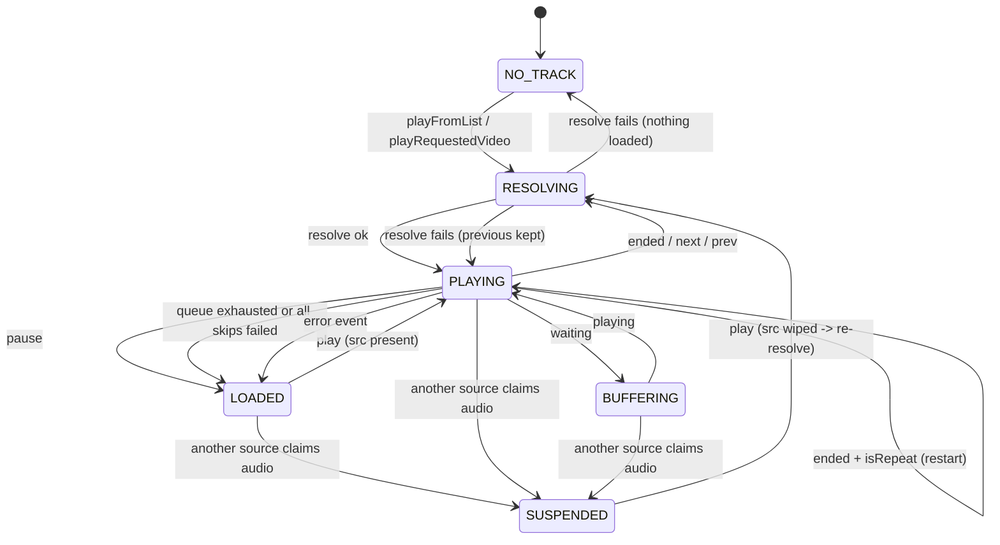

# YouTube Playback Lifecycle — State Spec v1
> **Source:** `src/lib/components/ui/YoutubePanel.svelte`, `src/lib/stores/youtubePanel.svelte.ts`
> **Authority:** code — the panel owns its `<audio>` element and reports to `mediaEngine` (see [audio-playback-lifecycle.md](./audio-playback-lifecycle.md), where YouTube is a *view-owned* source like podcast, not an engine-owned stream like radio).
> **Initial:** `NO_TRACK`
> **Last reconciled:** 2026-10-06

## States (6)

| # | State | Condition | Description |
|---|-------|-----------|-------------|
| 1 | `NO_TRACK` | `current==null && currentItem==null` | Nothing loaded. No `src`. No queued track. |
| 2 | `RESOLVING` | `resolvingId!=null` | An InnerTube player request is in flight. Entered from any state; see T3/T4 for where failure returns to. |
| 3 | `LOADED` | `currentItem!=null && audioEl.src!="" && isPlaying==false` | A real stream is loaded and paused. `play()` resumes the existing `src` with no network call. |
| 4 | `PLAYING` | `currentItem!=null && current!=null && isPlaying==true && isBuffering==false` | Audio active. `mediaEngine.youtubePlaying==true`; this panel owns the engine's transport handlers. |
| 5 | `BUFFERING` | `currentItem!=null && isBuffering==true` | Mid-playback stall. The spinner replaces the play/pause glyph. |
| 6 | `SUSPENDED` | `currentItem!=null && audioEl.src=="" && isPlaying==false` | Metadata is loaded but the element's `src` was wiped by another source claiming audio. **Playing from here requires a re-resolve** — see T7. |

**Closed world:** any condition not matching the above 6 states is invalid. `current!=null` without `currentItem!=null` is invalid. `isPlaying==true` without `current!=null && audioEl.src!=""` is invalid. `isBuffering==true` without `currentItem!=null` is invalid.

## Transitions (17)

| # | From | Event | Guard | To | Effects |
|---|------|-------|-------|----|---------|
| T1 | `NO_TRACK` | `playFromList(items,i)` or `playRequestedVideo(id)` | — | `RESOLVING` | `queue=items`, `resolvingId=id`, `error=''`. |
| T2 | `RESOLVING` | `resolveYoutubeAudio` ok | — | `PLAYING` | `startPlayback()`: sets `current`/`currentItem`/`queueIndex`/`duration`, `youtubePlaying=true`, `isPlaying=true`, `claimAudio('youtube')`, `setNowPlaying`, `claimEngineControls`, sets `src`, `load()`, `safePlay()`. |
| T3 | `RESOLVING` | resolve fails | `currentItem==null` | `NO_TRACK` | `error=describeYoutubeError(err)`, `resolvingId=null`. Flags left alone (nothing was playing). |
| T4 | `RESOLVING` | resolve fails | `currentItem!=null` | `PLAYING` \| `LOADED` \| `SUSPENDED` (unchanged) | `error` set, `resolvingId=null`. Engine flags deliberately untouched — a failed resolve changes nothing, so whatever was playing keeps playing. |
| T5 | `PLAYING` \| `BUFFERING` | `pause` event, or engine `_onPause` (MiniPlayer pause) | — | `LOADED` | `isPlaying=false`, `youtubePlaying=false`. `src` and metadata preserved. |
| T6 | `LOADED` | engine `_onPlay` (MiniPlayer play/resume) | `audioEl.src!=""` | `PLAYING` | `claimAudio('youtube')`, `youtubePlaying=true`, `isPlaying=true`, `claimEngineControls`, `safePlay()` — no re-resolve. |
| T7 | `SUSPENDED` | engine `_onPlay` (MiniPlayer play/resume) | `audioEl.src==""` | `RESOLVING` | `claimAudio`, flags set, `claimEngineControls`, then `playQueueItem(currentItem, queueIndex)` to re-resolve. A bare `play()` here is **forbidden** — it rejects with `NotSupportedError`. |
| T8 | `PLAYING` | `waiting` event | — | `BUFFERING` | `isBuffering=true`. |
| T9 | `BUFFERING` | `playing` event | — | `PLAYING` | `isBuffering=false`, `isPlaying=true`, `youtubePlaying=true`. |
| T10 | `PLAYING` | `ended` | `musicSettings.isRepeat` | `PLAYING` | `currentTime=0`, `safePlay()`. Restart, no re-resolve, no queue move. |
| T11 | `PLAYING` | `ended` (auto-advance), `goNext()`, `goPrev()` | — | `RESOLVING` | `advanceQueue(manual)` → `nextQueueIndex`/`previousQueueIndex` → `playQueueItem`. `goPrev` with `rewindOnPrev && currentTime>3` instead seeks to 0 and stays (`PLAYING`). |
| T12 | `PLAYING` | `ended` + `nextQueueIndex` returns null | `queueLoop==false` | `LOADED` | `stopQueue()`: `isPlaying=false`, `isBuffering=false`, `youtubePlaying=false`, `audioEl.pause()`. Metadata kept. |
| T13 | `PLAYING` | `goNext`/`goPrev` with every skip failing | `maxSkips` (3) exhausted | `LOADED` | `stopQueue()` as T12. Bounded so an all-unplayable queue cannot spin. |
| T14 | any | another source calls `claimAudio(other)` | — | `SUSPENDED` | `stopYoutubePlayback()`: `isPlaying=false`, `isBuffering=false`, `youtubePlaying=false`, `pause()`, `removeAttribute('src')`, `load()`. Metadata preserved; **the channel is released for the incoming source**. |
| T15 | `PLAYING` \| `BUFFERING` | `error` event | — | `LOADED` | `isPlaying=false`, `isBuffering=false`, `youtubePlaying=false`, "Playback failed. The audio link may have expired" shown. |
| T16 | `PLAYING` | `safePlay()` rejects with `AbortError` | retries left (6 native / 3 web) | `PLAYING` | Retry after 250 ms (native) / 150 ms (web). Internal — no observable state change. |
| T17 | `PLAYING` | `safePlay()` retries exhausted | — | `LOADED` | `isPlaying=false`, `youtubePlaying=false`, `onFailure()` toast. |

## Panel visibility (separate axis, 3 transitions)

Playback state and panel visibility are independent. The `<audio>` element is rendered **outside** the `{#if youtubePanel.open}` block precisely so these do not interact.

| # | From | Event | To | Effects |
|---|------|-------|----|---------|
| V1 | closed | `openYoutubePanel(videoId?)` — toolbar button, empty-state button, or MiniPlayer tap | open | `open=true`. If `videoId` given, `requestedVideoId=videoId`. |
| V2 | open | `closePanel()` | closed | `open=false`, `requestedVideoId=null`. **Playback state MUST be unchanged.** |
| V3 | open | effect: `requestedVideoId!=null` | open | Clears `requestedVideoId` inside `untrack()` (so the effect does not depend on its own write) then `playRequestedVideo(id)` → T1/T2. |

## Invariants & forbidden transitions

- `NO_TRACK → PLAYING` is forbidden. Every path into `PLAYING` passes through `RESOLVING` (T2) or `LOADED` (T6), so a track is always resolved first.
- `SUSPENDED → PLAYING` is forbidden. `src` must be re-established via T7 first; calling `play()` on a src-less element rejects with `NotSupportedError` and surfaces as the misleading "Could not start playback" toast.
- Closing the panel (V2) is forbidden from mutating playback state. Verified by an assertion in `tests/e2e/youtube.test.ts` that audio keeps playing after the panel closes.
- `isPlaying==true` implies `current!=null && currentItem!=null && audioEl.src!=""`. `youtubePlaying` mirrors `isPlaying` on every path except T4, where a failed resolve deliberately leaves both untouched.
- Every path into `PLAYING` calls `claimEngineControls()`, so the MiniPlayer, MediaSession and Android notification controls always address the panel's transport. `canSkipNext`/`canSkipPrevious` in the MiniPlayer exist only because this happens.
- Exactly one YouTube `<audio>` element can exist: the panel is rendered once at the shell level, not per music deck. `currentItem` is never null while `current` is.
- `queue` is always one of: `searchResults`, the favourites list, or a single resolved item. `queueIndex` indexes into it and is only assigned by `startPlayback`.
- YouTube never reaches `STREAM_RECONNECTING` (radio-only). A dropped stream is T15, and recovery is a fresh resolve on the next tap.
- `resolvingId!=null` ⇔ `RESOLVING`. The result rows and the search button are disabled while it is set.
- Live streams never enter `queue`: `searchYoutube` filters `is_live` results out, and anything that still fails to resolve is skipped (T13) rather than stalling.

---

## Diagram (for humans; LLMs may skip)

